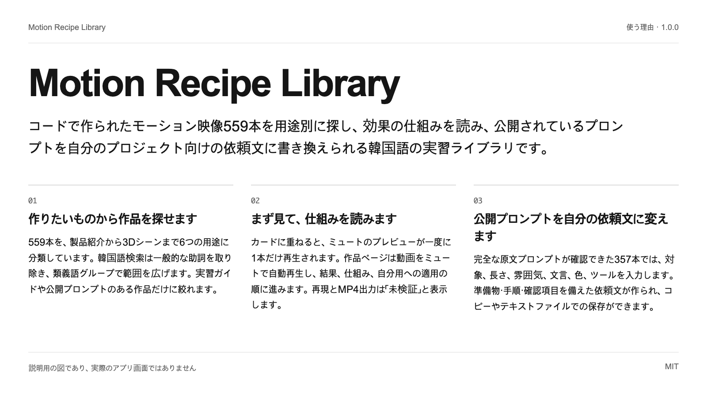
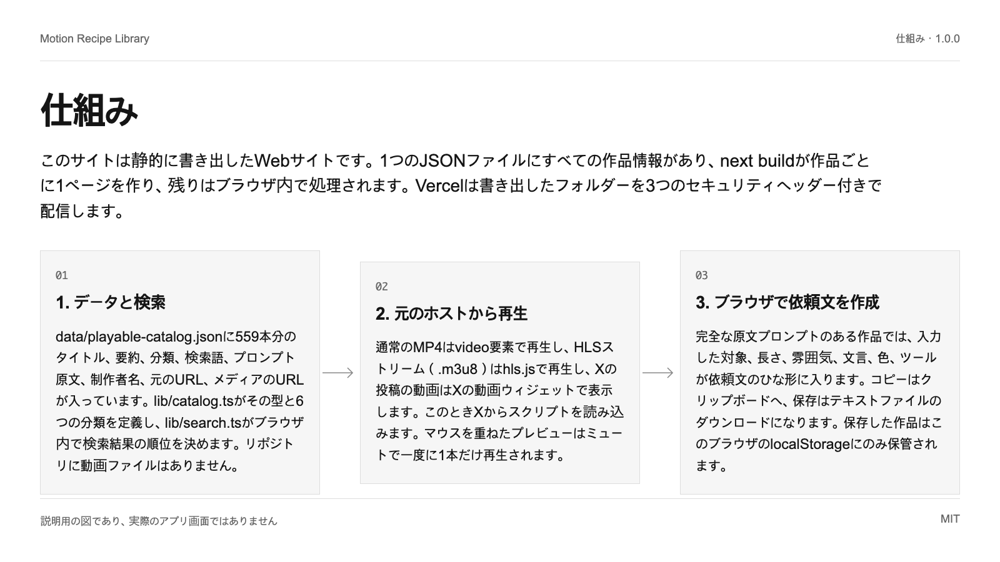
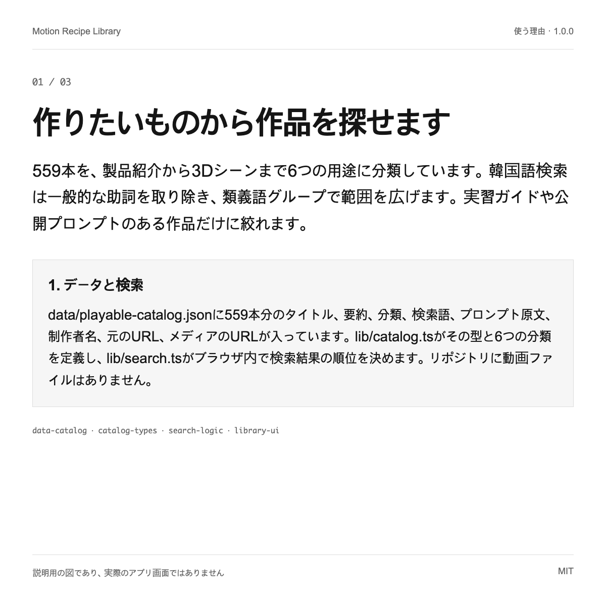
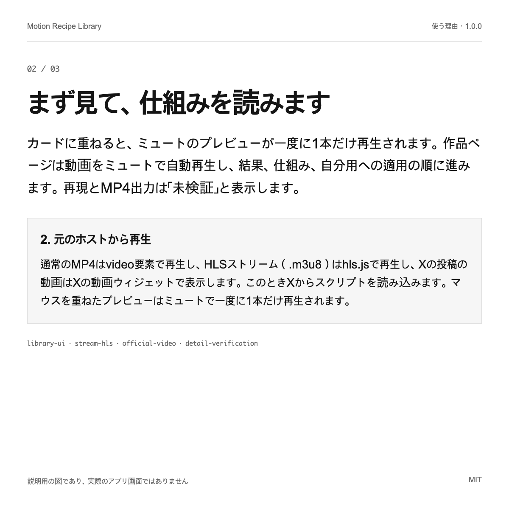
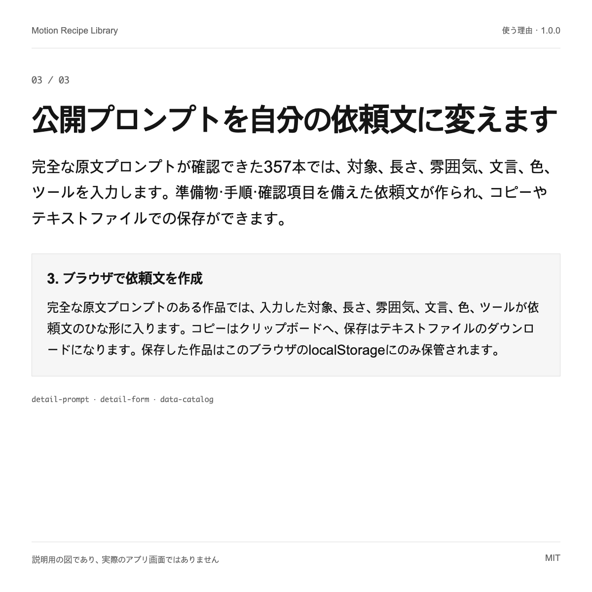

# Motion Recipe Library

コードで作られたモーション映像559本を用途別に探し、効果の仕組みを読み、公開されているプロンプトを自分のプロジェクト向けの依頼文に書き換えられる韓国語の実習ライブラリです。

[English](README.md) | [한국어](README.ko.md) | **日本語** | [简体中文](README.zh.md)




1.0.0 · MIT

## 使う理由

| | |
| --- | --- |
| 作りたいものから作品を探せます | 559本を、製品紹介から3Dシーンまで6つの用途に分類しています。韓国語検索は一般的な助詞を取り除き、類義語グループで範囲を広げます。実習ガイドや公開プロンプトのある作品だけに絞れます。 |
| まず見て、仕組みを読みます | カードに重ねると、ミュートのプレビューが一度に1本だけ再生されます。作品ページは動画をミュートで自動再生し、結果、仕組み、自分用への適用の順に進みます。再現とMP4出力は「未検証」と表示します。 |
| 公開プロンプトを自分の依頼文に変えます | 完全な原文プロンプトが確認できた357本では、対象、長さ、雰囲気、文言、色、ツールを入力します。準備物・手順・確認項目を備えた依頼文が作られ、コピーやテキストファイルでの保存ができます。 |

## クイックスタート

Node.js 20.9以降（Next.js 16.4.0の要件）とnpmが必要です。2つのコマンドはどちらもリポジトリのルートで実行します。動画は元のホストから直接読み込むため、インターネット接続が必要です。

```text
npm ci
npm run dev
```

Next.jsの開発サーバーが起動し、ローカルアドレス（既定はhttp://localhost:3000）が表示されます。開くと韓国語のライブラリが表示されます。静的ビルドはnpm run buildで作成し、結果はoutフォルダーに書き出されます。

## 仕組み

このサイトは静的に書き出したWebサイトです。1つのJSONファイルにすべての作品情報があり、next buildが作品ごとに1ページを作り、残りはブラウザ内で処理されます。Vercelは書き出したフォルダーを3つのセキュリティヘッダー付きで配信します。



### 1. データと検索

data/playable-catalog.jsonに559本分のタイトル、要約、分類、検索語、プロンプト原文、制作者名、元のURL、メディアのURLが入っています。lib/catalog.tsがその型と6つの分類を定義し、lib/search.tsがブラウザ内で検索結果の順位を決めます。リポジトリに動画ファイルはありません。

### 2. 元のホストから再生

通常のMP4はvideo要素で再生し、HLSストリーム（.m3u8）はhls.jsで再生し、Xの投稿の動画はXの動画ウィジェットで表示します。このときXからスクリプトを読み込みます。マウスを重ねたプレビューはミュートで一度に1本だけ再生されます。

### 3. ブラウザで依頼文を作成

完全な原文プロンプトのある作品では、入力した対象、長さ、雰囲気、文言、色、ツールが依頼文のひな形に入ります。コピーはクリップボードへ、保存はテキストファイルのダウンロードになります。保存した作品はこのブラウザのlocalStorageにのみ保管されます。

## 活用例

### 製品紹介動画の参考作品を選ぶ

製品・サービス紹介の分類でプレビューをいくつか見て、気に入った作品の仕組みを読みます。次に入力欄へ自分のサービス名、動画の長さ、色を入れ、できた依頼文を使っているAIエージェントに渡します。

### 効果の仕組みを学ぶ

16本には、原理、準備物、手順、確認項目、トラブル対処をまとめた実習ガイドがあります。学習用に書いた編集資料で、エージェントに実装を頼む前に技法を理解するために使えます。

### 自分のギャラリーの基本構造として再利用する

アプリは形式が決まった1つのJSONファイルを読み、静的ページとして書き出します。データファイルを、表示する権利のある作品情報に差し替え、権利案内ページを直したうえで、outフォルダーを静的ファイルを配信できる場所ならどこへでも配置できます。







## 制約とプライバシー

- このリポジトリには動画がありません。動画とポスターは元のホストから読み込むため、ホストがファイルを削除または変更すると、その作品は再生されなくなります。再生の可否はデータを収集・デプロイした2026-10-07に確認しており、その後は監視していません。

- 作品、そのプロンプト、メディアの権利は各制作者にあります。MITライセンスはコードと編集文にのみ適用されます。559本のうち84本は、ライセンス表示が見つからなかった出典から来ているため、再利用する前に元のページを確認してください。

- ページを開くと、動画ホスト、Google Fonts、Xウィジェットで表示する投稿のXなど、外部ホストに接続します。これらのホストは訪問者のIPアドレスを確認できます。アプリ自体に分析コードはなく、独自のAPI呼び出しもありません。

- ライブラリは収集したプロンプトをそのまま表示します。プロンプトは実行しておらず、AIエージェントが同じ結果を再現するとも主張しません。データ上で、実行・再現・出力済みと記録した作品はなく、難易度も評価していません。完全な原文がない作品には、適用用の依頼文は提供しません。

- データ収集時にブラウザで再生できた作品だけを掲載しています。収集した818本のうち559本です。残りの259本は制作者の非公開の作業フォルダーにあります。

- 収集スクリプト、収集した元データ、テストスクリプト、検証ログはこのリポジトリにないため、ここからデータファイルを再生成することはできません。確認済みのスナップショットとして扱ってください。

- アプリの画面と編集文は韓国語のみで、翻訳されているのはこのREADMEだけです。保存した作品は1つのブラウザにだけ残り、端末間では同期されません。

## 検証状況

- **実行確認済み**: npm run typecheck（tsc --noEmit）は2026-10-08に終了コード0で完了しました。
- **実行確認済み**: npm run buildは2026-10-08に終了コード0で完了し、作品ページ559件、ホーム、権利案内ページを事前レンダリングしました。
- **実行確認済み**: 2026-10-08にdata/playable-catalog.jsonの項目を数えるスクリプトを実行したところ、作品559本、異なる制作者名503、実習ガイド16本、完全な原文プロンプトのある作品357本でした。実行・再現・出力済みと記録した作品はありませんでした。
- **実行確認済み**: 各作品のreferenceUrlのドメインを数えると、skillry.dev 475、prompt-motion.com 38、remotion.dev 25、x.com 15、brochbuilds.com 6です。
- **コード確認済み**: LICENSE（MIT）とTHIRD_PARTY_NOTICES.mdがあり、元の一覧リポジトリのMIT表示をpublic/noticesに保存しています。
- **文書に記載**: 検索、フィルター、保存、詳細ページの動画再生、コピー、ファイル保存のブラウザ検査は、デプロイ前に制作者の非公開の作業フォルダーで実行しました。そのテストスクリプトは公開していないため、このリポジトリだけでは同じ結果を再現できません。

## 次のステップ

実際のサイトは https://motion-recipe-library.vercel.app で見られます。作品を別の場所で使う前にTHIRD_PARTY_NOTICES.mdを読んでください。不具合や削除のご依頼はIssueでお知らせください。

<details>
<summary>根拠一覧</summary>

[JSON](docs/showcase/sources.json)

- `data-catalog`: `data/README.md`, L1–L68 (実行確認済み)
- `catalog-types`: `lib/catalog.ts`, L1–L83 (コード確認済み)
- `search-logic`: `lib/search.ts`, L1–L76 (コード確認済み)
- `library-ui`: `components/Library.tsx`, L56–L156 (コード確認済み)
- `library-saved`: `components/Library.tsx`, L120–L136 (コード確認済み)
- `detail-prompt`: `components/RecipeDetail.tsx`, L15–L96 (コード確認済み)
- `detail-form`: `components/RecipeDetail.tsx`, L436–L483 (コード確認済み)
- `detail-verification`: `components/RecipeDetail.tsx`, L197–L225 (コード確認済み)
- `stream-hls`: `lib/use-stream.ts`, L1–L29 (コード確認済み)
- `official-video`: `components/OfficialVideo.tsx`, L21–L105 (コード確認済み)
- `creator-layout`: `app/layout.tsx`, L17–L35 (コード確認済み)
- `fonts-import`: `app/globals.css`, L4–L4 (コード確認済み)
- `notices-page`: `app/notices/page.tsx`, L1–L31 (コード確認済み)
- `upstream-mit`: `public/notices/awesome-opus5-5-videos-MIT.txt`, L1–L21 (文書に記載)
- `third-party`: `THIRD_PARTY_NOTICES.md`, L1–L74 (文書に記載)
- `license-file`: `LICENSE`, L1–L21 (文書に記載)
- `static-export`: `next.config.ts`, L1–L7 (コード確認済み)
- `security-headers`: `vercel.json`, L1–L5 (コード確認済み)
- `package-scripts`: `package.json`, L16–L21 (実行確認済み)
- `node-engine`: `package-lock.json`, L788–L806 (文書に記載)
- `private-boundary`: `.gitignore`, L9–L23 (文書に記載)

- `find-by-intent` → `data-catalog`, `catalog-types`, `search-logic`, `library-ui`
- `see-and-understand` → `library-ui`, `stream-hls`, `official-video`, `detail-verification`
- `adapt-the-prompt` → `detail-prompt`, `detail-form`, `data-catalog`
- `data-search` → `data-catalog`, `catalog-types`, `search-logic`, `static-export`, `security-headers`
- `playback` → `stream-hls`, `official-video`, `library-ui`
- `worksheet` → `detail-prompt`, `detail-form`, `library-saved`
- `reference-for-intro` → `library-ui`, `detail-form`
- `learn-principle` → `detail-prompt`, `catalog-types`, `data-catalog`
- `reuse-structure` → `catalog-types`, `static-export`, `notices-page`
- `media-not-hosted` → `official-video`, `stream-hls`, `third-party`
- `rights` → `third-party`, `license-file`, `notices-page`
- `third-party-hosts` → `official-video`, `stream-hls`, `fonts-import`
- `not-reproduced` → `detail-verification`, `data-catalog`
- `selection` → `private-boundary`, `data-catalog`
- `pipeline-private` → `private-boundary`
- `korean-only` → `creator-layout`, `library-saved`
- `check-typecheck` → `package-scripts`
- `check-build` → `package-scripts`, `static-export`
- `check-data-counts` → `data-catalog`
- `check-sources` → `data-catalog`, `third-party`
- `check-license-files` → `license-file`, `third-party`, `upstream-mit`
- `check-browser-checks` → `private-boundary`
- `quickstart` → `package-scripts`, `node-engine`, `static-export`

</details>
