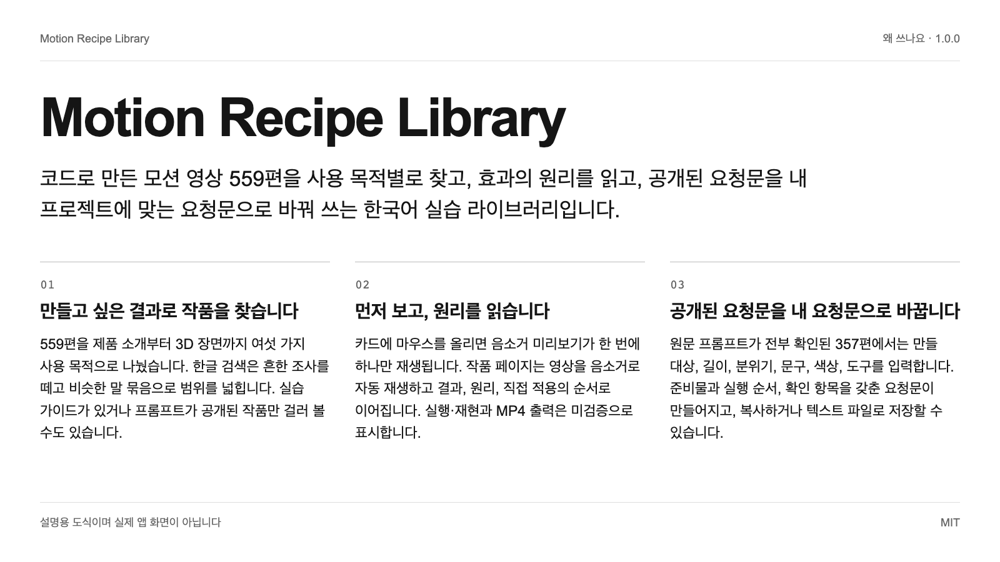
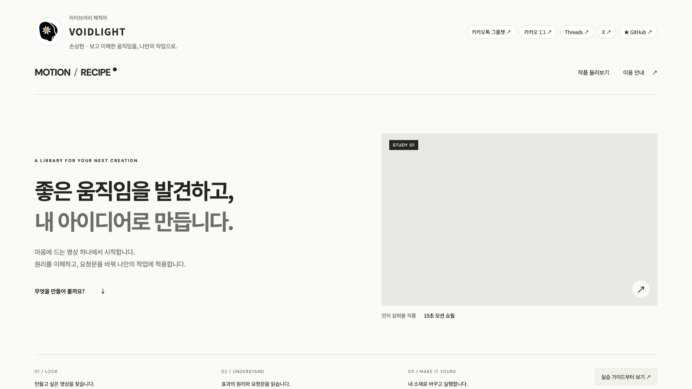
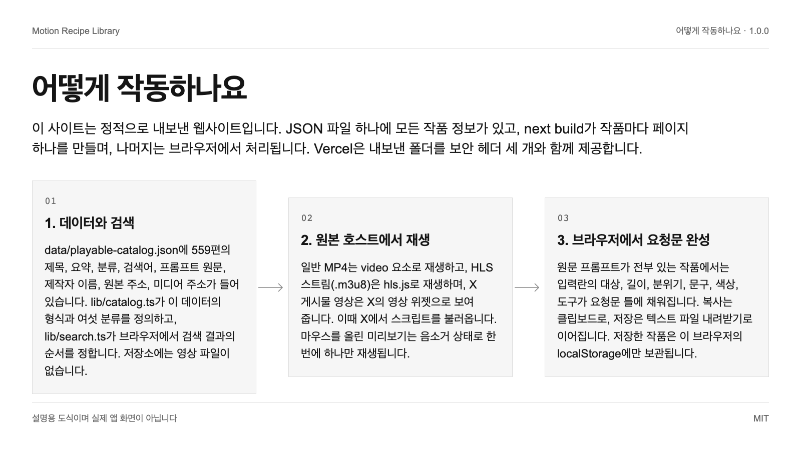
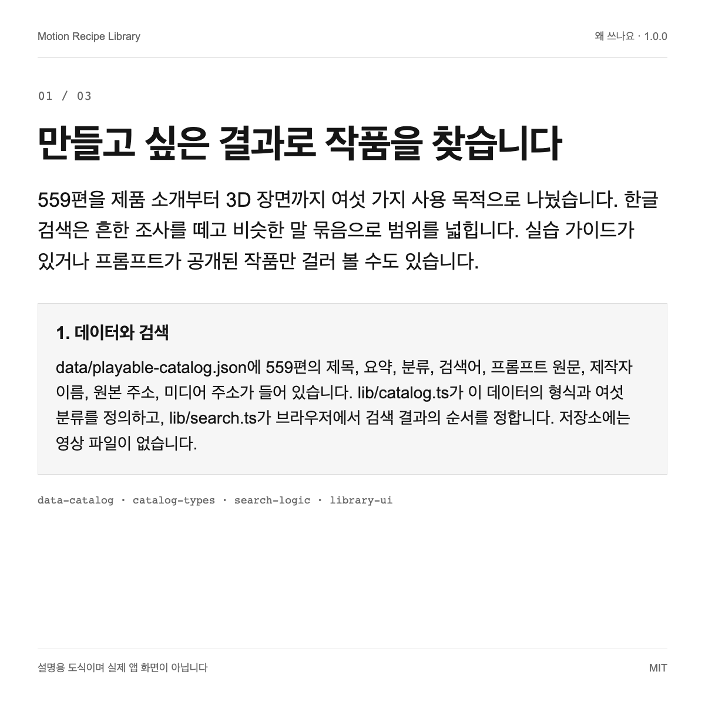
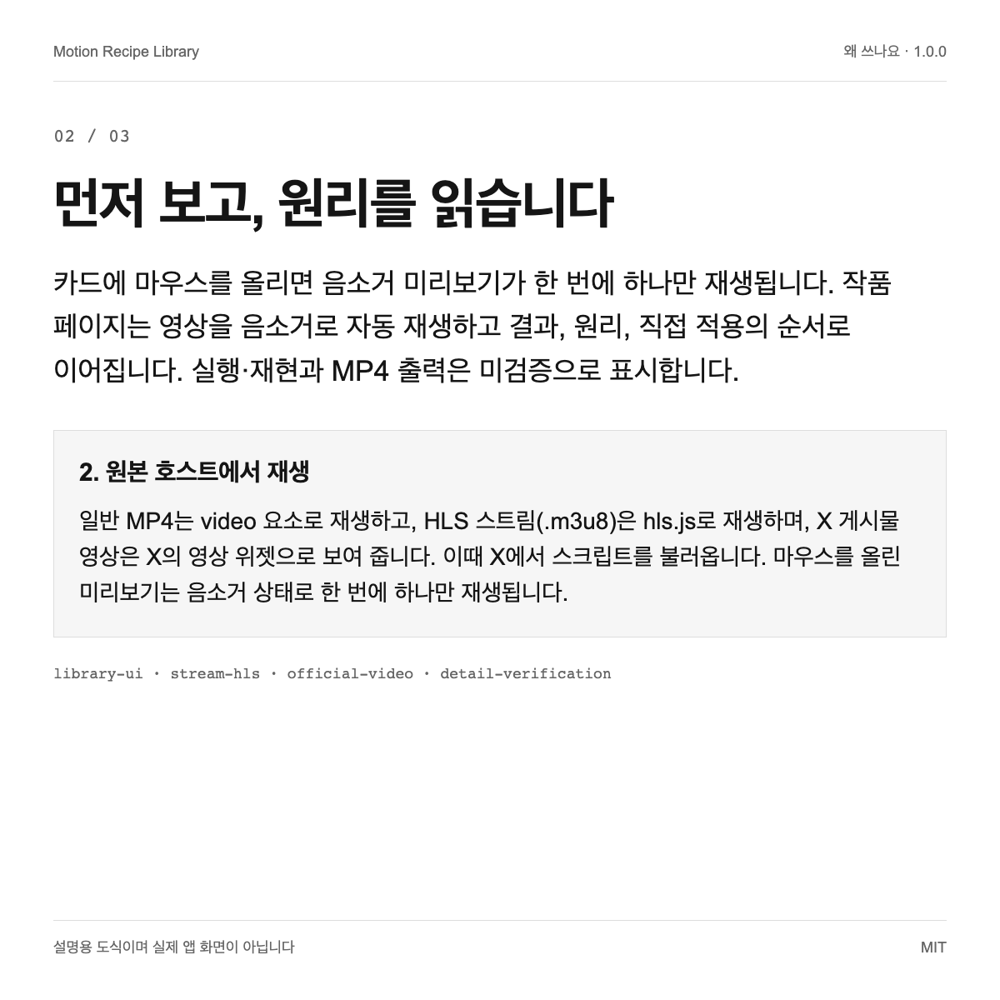
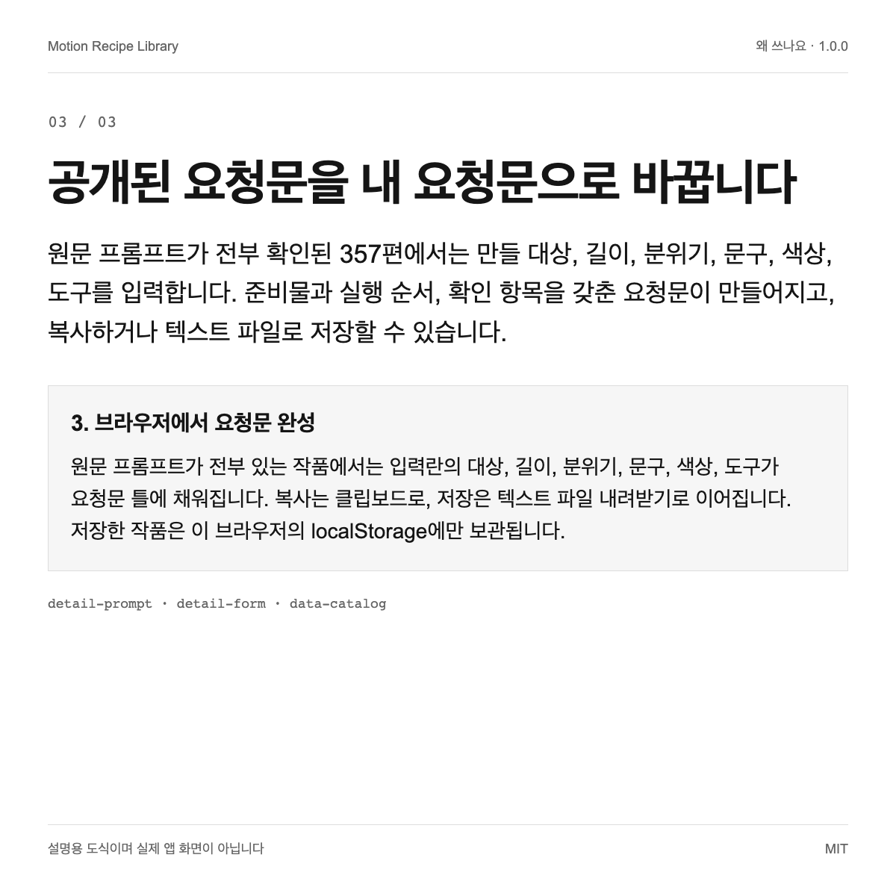

# Motion Recipe Library

코드로 만든 모션 영상 559편을 사용 목적별로 찾고, 효과의 원리를 읽고, 공개된 요청문을 내 프로젝트에 맞는 요청문으로 바꿔 쓰는 한국어 실습 라이브러리입니다.

[English](README.md) | **한국어** | [日本語](README.ja.md) | [简体中文](README.zh.md)





1.0.0 · MIT

## 왜 쓰나요

| | |
| --- | --- |
| 만들고 싶은 결과로 작품을 찾습니다 | 559편을 제품 소개부터 3D 장면까지 여섯 가지 사용 목적으로 나눴습니다. 한글 검색은 흔한 조사를 떼고 비슷한 말 묶음으로 범위를 넓힙니다. 실습 가이드가 있거나 프롬프트가 공개된 작품만 걸러 볼 수도 있습니다. |
| 먼저 보고, 원리를 읽습니다 | 카드에 마우스를 올리면 음소거 미리보기가 한 번에 하나만 재생됩니다. 작품 페이지는 영상을 음소거로 자동 재생하고 결과, 원리, 직접 적용의 순서로 이어집니다. 실행·재현과 MP4 출력은 미검증으로 표시합니다. |
| 공개된 요청문을 내 요청문으로 바꿉니다 | 원문 프롬프트가 전부 확인된 357편에서는 만들 대상, 길이, 분위기, 문구, 색상, 도구를 입력합니다. 준비물과 실행 순서, 확인 항목을 갖춘 요청문이 만들어지고, 복사하거나 텍스트 파일로 저장할 수 있습니다. |

## 빠른 시작

Node.js 20.9 이상(Next.js 16.4.0의 요구 사항)과 npm이 필요합니다. 두 명령은 모두 저장소 루트에서 실행합니다. 영상은 원래 호스트에서 직접 불러오므로 인터넷 연결이 필요합니다.

```text
npm ci
npm run dev
```

Next.js 개발 서버가 시작되고 로컬 주소(기본값 http://localhost:3000)가 출력됩니다. 그 주소를 열면 한국어 라이브러리가 나타납니다. 정적 빌드는 npm run build로 만들며, 결과는 out 폴더로 내보내집니다.

## 어떻게 작동하나요

이 사이트는 정적으로 내보낸 웹사이트입니다. JSON 파일 하나에 모든 작품 정보가 있고, next build가 작품마다 페이지 하나를 만들며, 나머지는 브라우저에서 처리됩니다. Vercel은 내보낸 폴더를 보안 헤더 세 개와 함께 제공합니다.



### 1. 데이터와 검색

data/playable-catalog.json에 559편의 제목, 요약, 분류, 검색어, 프롬프트 원문, 제작자 이름, 원본 주소, 미디어 주소가 들어 있습니다. lib/catalog.ts가 이 데이터의 형식과 여섯 분류를 정의하고, lib/search.ts가 브라우저에서 검색 결과의 순서를 정합니다. 저장소에는 영상 파일이 없습니다.

### 2. 원본 호스트에서 재생

일반 MP4는 video 요소로 재생하고, HLS 스트림(.m3u8)은 hls.js로 재생하며, X 게시물 영상은 X의 영상 위젯으로 보여 줍니다. 이때 X에서 스크립트를 불러옵니다. 마우스를 올린 미리보기는 음소거 상태로 한 번에 하나만 재생됩니다.

### 3. 브라우저에서 요청문 완성

원문 프롬프트가 전부 있는 작품에서는 입력란의 대상, 길이, 분위기, 문구, 색상, 도구가 요청문 틀에 채워집니다. 복사는 클립보드로, 저장은 텍스트 파일 내려받기로 이어집니다. 저장한 작품은 이 브라우저의 localStorage에만 보관됩니다.

## 사용 예시

### 제품 소개 영상의 참고 작품 고르기

제품·서비스 소개 분류에서 미리보기 여러 편을 보고, 마음에 드는 작품의 원리를 읽습니다. 그다음 입력란에 내 서비스 이름과 영상 길이, 색상을 적고 만들어진 요청문을 사용하는 AI 에이전트에 전달합니다.

### 효과가 어떻게 작동하는지 배우기

16편에는 원리, 준비물, 실행 순서, 확인 항목, 문제 해결을 담은 실습 가이드가 있습니다. 학습용으로 작성한 편집 자료이며, 에이전트에게 구현을 맡기기 전에 기법을 이해하는 용도로 쓸 수 있습니다.

### 내 갤러리의 기본 구조로 재사용하기

앱은 형식이 정해진 JSON 파일 하나를 읽어 정적 페이지로 내보냅니다. 데이터 파일을 직접 보여 줄 권리가 있는 작품 정보로 바꾸고 권리 안내 페이지를 맞게 고친 다음, out 폴더를 정적 파일을 제공하는 곳이면 어디에든 배포할 수 있습니다.







## 한계와 개인정보

- 이 저장소에는 영상이 없습니다. 영상과 포스터는 원래 호스트에서 불러오므로, 호스트가 파일을 지우거나 바꾸면 해당 작품은 재생되지 않습니다. 재생 여부는 자료를 수집하고 배포한 2026-10-07에 확인했으며, 그 뒤로는 감시하지 않습니다.

- 작품과 그 요청문, 미디어의 권리는 각 제작자에게 있습니다. MIT 라이선스는 코드와 편집 문구에만 적용됩니다. 559편 가운데 84편은 라이선스 표시를 찾지 못한 출처에서 왔으므로, 다른 곳에 쓰기 전에 원본 페이지를 확인해 주십시오.

- 페이지를 열면 영상 호스트, Google Fonts, 그리고 X 위젯으로 보여 주는 게시물의 X 같은 외부 호스트에 접속합니다. 이 호스트들은 방문자의 IP 주소를 볼 수 있습니다. 앱 자체에는 분석 코드가 없고 자체 API 호출도 없습니다.

- 라이브러리는 수집한 요청문을 그대로 보여 줍니다. 요청문을 실행해 보지 않았고, AI 에이전트가 같은 결과를 재현한다고 주장하지도 않습니다. 데이터에서 실행·재현·출력을 마쳤다고 표시한 작품은 없으며 난이도도 평가하지 않았습니다. 전체 원문이 없는 작품에는 적용용 요청문을 제공하지 않습니다.

- 자료를 수집할 때 브라우저에서 재생된 작품만 실었습니다. 수집한 818편 가운데 559편입니다. 나머지 259편은 제작자의 비공개 작업 폴더에만 있습니다.

- 수집 스크립트, 수집 원본, 테스트 스크립트, 검증 로그는 이 저장소에 없으므로 여기서 데이터 파일을 다시 만들 수 없습니다. 검토를 마친 스냅샷으로 봐 주십시오.

- 앱 화면과 편집 문구는 한국어로만 제공하며 이 README만 번역되어 있습니다. 저장한 작품은 한 브라우저에만 남고 기기 사이에 동기화되지 않습니다.

## 검증 상태

- **실행 확인**: 2026-10-08에 새로 클론한 저장소에서 npm ci로 패키지 33개를 설치했고, npm run typecheck(tsc --noEmit)가 종료 코드 0으로 끝났습니다.
- **실행 확인**: 같은 클론에서 npm run build가 종료 코드 0으로 끝났고 작품 페이지 559개, 홈, 권리 안내 페이지를 미리 렌더링했습니다. npm run dev는 http://localhost:3000에서 HTTP 200으로 응답했습니다.
- **실행 확인**: 2026-10-08에 data/playable-catalog.json의 항목을 세는 스크립트를 실행한 결과, 작품 559편, 서로 다른 제작자 이름 503개, 실습 가이드 16편, 원문 프롬프트 전체가 있는 작품 357편이었습니다. 실행·재현·출력을 마쳤다고 표시한 작품은 없었습니다.
- **실행 확인**: 작품마다 referenceUrl의 도메인을 세면 skillry.dev 475편, prompt-motion.com 38편, remotion.dev 25편, x.com 15편, brochbuilds.com 6편입니다.
- **코드 확인**: LICENSE(MIT)와 THIRD_PARTY_NOTICES.md가 있고, 원본 목록 저장소의 MIT 고지문을 public/notices에 보존했습니다.
- **문서 기준**: 검색, 필터, 저장, 상세 영상 재생, 복사, 파일 저장에 대한 브라우저 검사는 배포 전에 제작자의 비공개 작업 폴더에서 실행했습니다. 그 테스트 스크립트는 공개하지 않았으므로 이 저장소만으로는 같은 결과를 다시 만들 수 없습니다.

## 다음 단계

실제 사이트는 https://motion-recipe-library.vercel.app 에서 둘러볼 수 있습니다. 작품을 다른 곳에 쓰기 전에 THIRD_PARTY_NOTICES.md를 읽어 주십시오. 오류와 삭제 요청은 이슈로 남겨 주십시오.

<details>
<summary>근거 목록</summary>

[JSON](docs/showcase/sources.json)

- `data-catalog`: `data/README.md`, L1–L68 (실행 확인)
- `catalog-types`: `lib/catalog.ts`, L1–L83 (코드 확인)
- `search-logic`: `lib/search.ts`, L1–L76 (코드 확인)
- `library-ui`: `components/Library.tsx`, L56–L156 (코드 확인)
- `library-saved`: `components/Library.tsx`, L120–L136 (코드 확인)
- `detail-prompt`: `components/RecipeDetail.tsx`, L15–L96 (코드 확인)
- `detail-form`: `components/RecipeDetail.tsx`, L436–L483 (코드 확인)
- `detail-verification`: `components/RecipeDetail.tsx`, L197–L225 (코드 확인)
- `stream-hls`: `lib/use-stream.ts`, L1–L29 (코드 확인)
- `official-video`: `components/OfficialVideo.tsx`, L21–L105 (코드 확인)
- `creator-layout`: `app/layout.tsx`, L17–L35 (코드 확인)
- `fonts-import`: `app/globals.css`, L4–L4 (코드 확인)
- `notices-page`: `app/notices/page.tsx`, L1–L31 (코드 확인)
- `upstream-mit`: `public/notices/awesome-opus5-5-videos-MIT.txt`, L1–L21 (문서 기준)
- `third-party`: `THIRD_PARTY_NOTICES.md`, L1–L74 (문서 기준)
- `license-file`: `LICENSE`, L1–L21 (문서 기준)
- `static-export`: `next.config.ts`, L1–L7 (코드 확인)
- `security-headers`: `vercel.json`, L1–L5 (코드 확인)
- `package-scripts`: `package.json`, L16–L21 (실행 확인)
- `node-engine`: `package-lock.json`, L788–L806 (문서 기준)
- `private-boundary`: `.gitignore`, L9–L23 (문서 기준)

- `find-by-intent` → `data-catalog`, `catalog-types`, `search-logic`, `library-ui`
- `see-and-understand` → `library-ui`, `stream-hls`, `official-video`, `detail-verification`
- `adapt-the-prompt` → `detail-prompt`, `detail-form`, `data-catalog`
- `data-search` → `data-catalog`, `catalog-types`, `search-logic`, `static-export`, `security-headers`
- `playback` → `stream-hls`, `official-video`, `library-ui`
- `worksheet` → `detail-prompt`, `detail-form`, `library-saved`
- `reference-for-intro` → `library-ui`, `detail-form`
- `learn-principle` → `detail-prompt`, `catalog-types`, `data-catalog`
- `reuse-structure` → `catalog-types`, `static-export`, `notices-page`
- `media-not-hosted` → `official-video`, `stream-hls`, `third-party`
- `rights` → `third-party`, `license-file`, `notices-page`
- `third-party-hosts` → `official-video`, `stream-hls`, `fonts-import`
- `not-reproduced` → `detail-verification`, `data-catalog`
- `selection` → `private-boundary`, `data-catalog`
- `pipeline-private` → `private-boundary`
- `korean-only` → `creator-layout`, `library-saved`
- `check-typecheck` → `package-scripts`
- `check-build` → `package-scripts`, `static-export`
- `check-data-counts` → `data-catalog`
- `check-sources` → `data-catalog`, `third-party`
- `check-license-files` → `license-file`, `third-party`, `upstream-mit`
- `check-browser-checks` → `private-boundary`
- `quickstart` → `package-scripts`, `node-engine`, `static-export`

</details>
