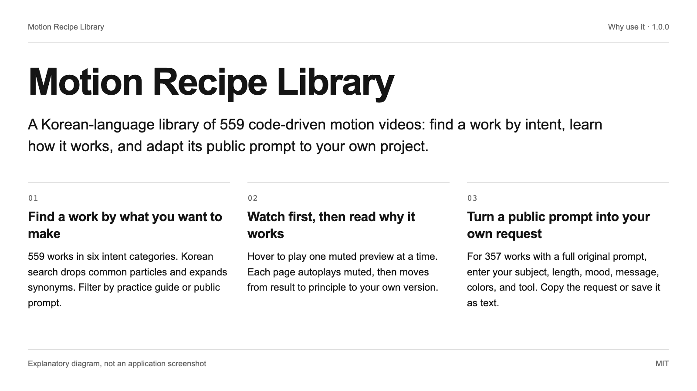
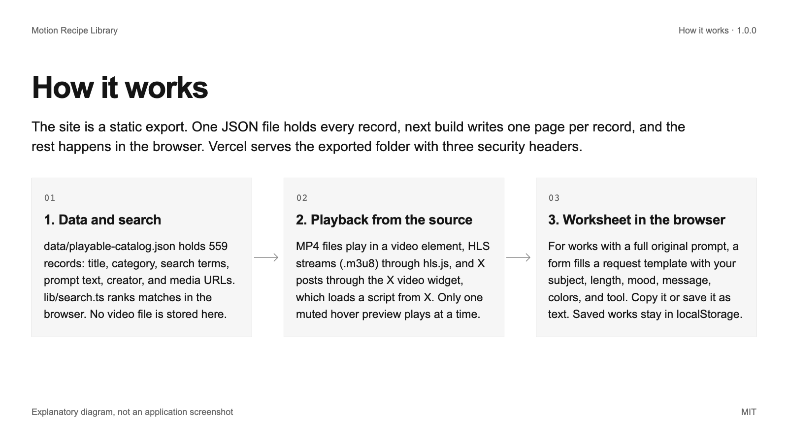
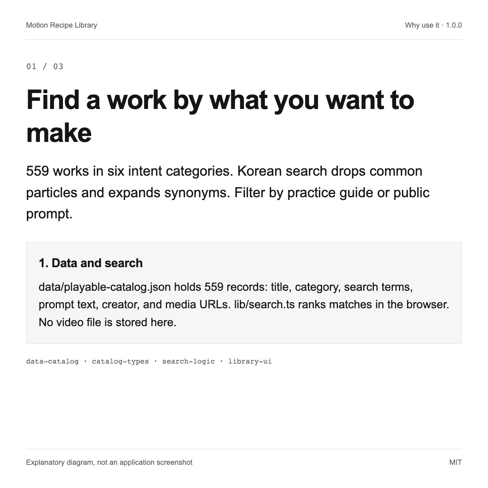
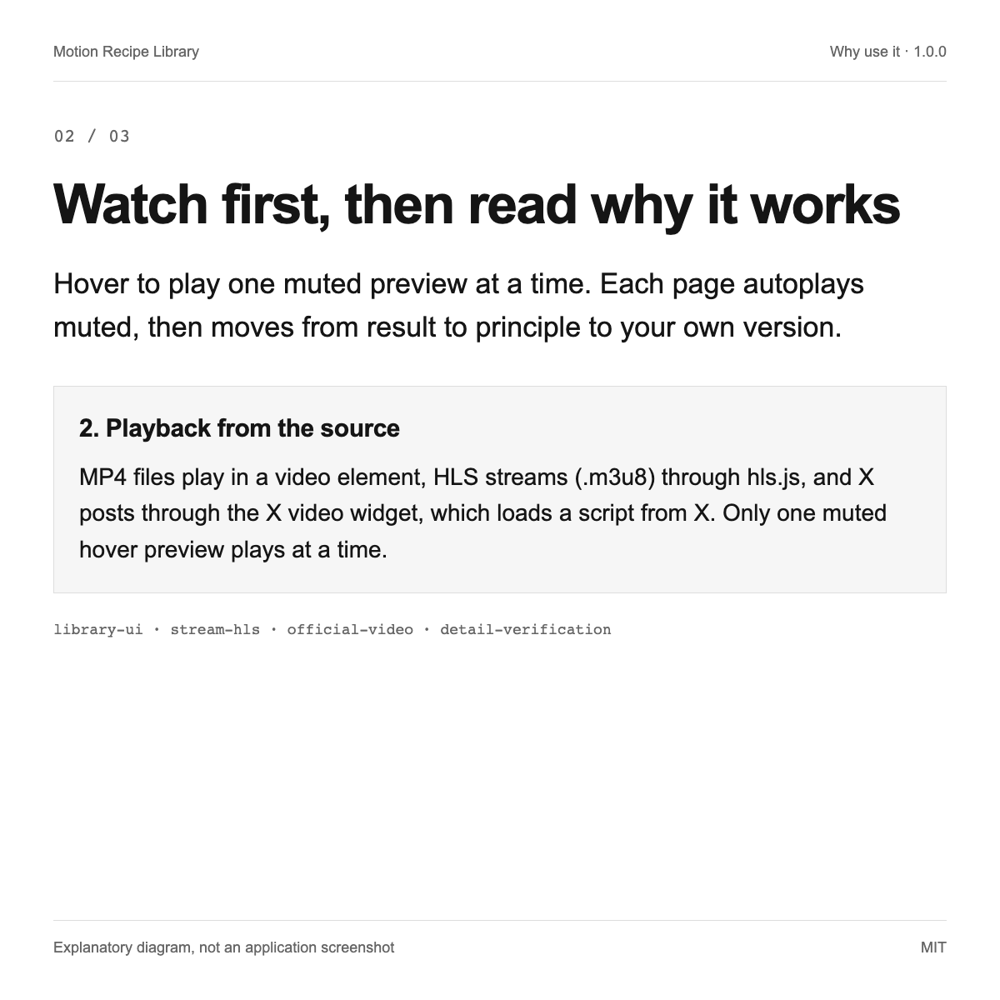
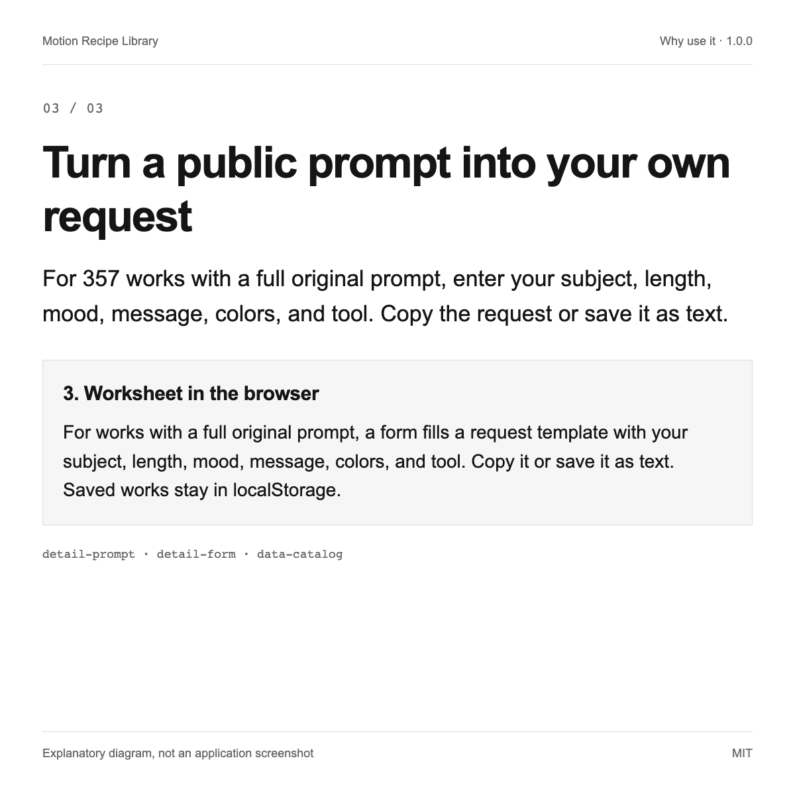

# Motion Recipe Library

A Korean-language library of 559 code-driven motion videos: find a work by intent, learn how it works, and adapt its public prompt to your own project.

**English** | [한국어](README.ko.md) | [日本語](README.ja.md) | [简体中文](README.zh.md)




1.0.0 · MIT

## Why use it

| | |
| --- | --- |
| Find a work by what you want to make | 559 works in six intent categories. Korean search drops common particles and expands synonyms. Filter by practice guide or public prompt. |
| Watch first, then read why it works | Hover to play one muted preview at a time. Each page autoplays muted, then moves from result to principle to your own version. |
| Turn a public prompt into your own request | For 357 works with a full original prompt, enter your subject, length, mood, message, colors, and tool. Copy the request or save it as text. |

## Quick start

Node.js 20.9 or newer (required by Next.js 16.4.0) and npm. Run both commands in the repository root. Videos stream from their original hosts, so an internet connection is needed.

```text
npm ci
npm run dev
```

Next.js starts a development server and prints its local address, by default http://localhost:3000. Open it to see the Korean-language library. For a static build, run npm run build; the site is exported to the out folder.

## How it works

The site is a static export. One JSON file holds every record, next build writes one page per record, and the rest happens in the browser. Vercel serves the exported folder with three security headers.



### 1. Data and search

data/playable-catalog.json holds 559 records: title, category, search terms, prompt text, creator, and media URLs. lib/search.ts ranks matches in the browser. No video file is stored here.

### 2. Playback from the source

MP4 files play in a video element, HLS streams (.m3u8) through hls.js, and X posts through the X video widget, which loads a script from X. Only one muted hover preview plays at a time.

### 3. Worksheet in the browser

For works with a full original prompt, a form fills a request template with your subject, length, mood, message, colors, and tool. Copy it or save it as text. Saved works stay in localStorage.

## Use cases

### Pick a reference for a product intro

Open the product and service category, watch several previews, and read the principle of the one you like. Then enter your own service name, length, and colors in the worksheet and hand the result to your AI agent.

### Learn how an effect works

Sixteen works include a practice guide with the principle, materials, steps, checks, and troubleshooting. The author wrote the guides for learning. Use them to understand a technique before you ask an agent to build it.

### Reuse the structure for your own gallery

The app reads one JSON file of one fixed shape and exports static pages. Replace the data file with records you have the right to show, update the notice page, and deploy the out folder anywhere that serves static files.







## Limits and privacy

- No video is stored here. Videos and posters load from their original hosts, so a host can remove or change a file and the work then stops playing. Playback was checked on 2026-10-07, when the data was collected and deployed, and is not monitored afterward.

- Each work, its prompt, and its media belong to the creator. The MIT license covers only the code and the editorial text. 84 of the 559 records come from sources where no license statement was found, so check the original page before you reuse anything.

- Opening a page contacts third-party hosts: the media hosts, Google Fonts, and X for posts shown with its widget. Those hosts can see the visitor's IP address. The app itself has no analytics code and makes no API calls of its own.

- The library shows prompts as collected. It did not run them and does not claim that an AI agent reproduces a work. In the data, no record is marked as executed, reproduced, or exported, and difficulty is unrated. Works without a full original prompt get no adapted request.

- Only works that played in a browser when the data was collected are listed: 559 of 818 collected records. The other 259 stay in the author's private working folder.

- The collection scripts, raw snapshots, test scripts, and QA logs are not in this repository, so the data file cannot be rebuilt from here. Treat it as a reviewed snapshot.

- The app interface and all editorial text are in Korean only; only this README is translated. Saved works stay in one browser and do not sync across devices.

## Verification

- **Execution verified**: In a fresh clone made on 2026-10-08, npm ci installed 33 packages and npm run typecheck (tsc --noEmit) exited with code 0.
- **Execution verified**: In the same clone, npm run build exited with code 0 and prerendered 559 recipe pages, the home page, and the notice page. npm run dev answered HTTP 200 at http://localhost:3000.
- **Execution verified**: A script that counted the records in data/playable-catalog.json on 2026-10-08 found 559 records, 503 distinct creator handles, 16 practice guides, and 357 works with a full original prompt. It found no record marked as executed, reproduced, or exported.
- **Execution verified**: Counting the referenceUrl domain of each record gives skillry.dev 475, prompt-motion.com 38, remotion.dev 25, x.com 15, and brochbuilds.com 6.
- **Source inspected**: LICENSE (MIT) and THIRD_PARTY_NOTICES.md exist, and the upstream MIT notice is kept in public/notices.
- **Documented**: Browser checks for search, filters, saved works, detail playback, copy, and download ran in the author's private working folder before deployment. Those test scripts are not published, so this repository does not reproduce that result.

## Next steps

Browse the live site at https://motion-recipe-library.vercel.app. Read THIRD_PARTY_NOTICES.md before you reuse any work, and open an issue for bugs or takedown requests.

<details>
<summary>Source map</summary>

[JSON](docs/showcase/sources.json)

- `data-catalog`: `data/README.md`, L1–L68 (Execution verified)
- `catalog-types`: `lib/catalog.ts`, L1–L83 (Source inspected)
- `search-logic`: `lib/search.ts`, L1–L76 (Source inspected)
- `library-ui`: `components/Library.tsx`, L56–L156 (Source inspected)
- `library-saved`: `components/Library.tsx`, L120–L136 (Source inspected)
- `detail-prompt`: `components/RecipeDetail.tsx`, L15–L96 (Source inspected)
- `detail-form`: `components/RecipeDetail.tsx`, L436–L483 (Source inspected)
- `detail-verification`: `components/RecipeDetail.tsx`, L197–L225 (Source inspected)
- `stream-hls`: `lib/use-stream.ts`, L1–L29 (Source inspected)
- `official-video`: `components/OfficialVideo.tsx`, L21–L105 (Source inspected)
- `creator-layout`: `app/layout.tsx`, L17–L35 (Source inspected)
- `fonts-import`: `app/globals.css`, L4–L4 (Source inspected)
- `notices-page`: `app/notices/page.tsx`, L1–L31 (Source inspected)
- `upstream-mit`: `public/notices/awesome-opus5-5-videos-MIT.txt`, L1–L21 (Documented)
- `third-party`: `THIRD_PARTY_NOTICES.md`, L1–L74 (Documented)
- `license-file`: `LICENSE`, L1–L21 (Documented)
- `static-export`: `next.config.ts`, L1–L7 (Source inspected)
- `security-headers`: `vercel.json`, L1–L5 (Source inspected)
- `package-scripts`: `package.json`, L16–L21 (Execution verified)
- `node-engine`: `package-lock.json`, L788–L806 (Documented)
- `private-boundary`: `.gitignore`, L9–L23 (Documented)

- `find-by-intent` → `data-catalog`, `catalog-types`, `search-logic`, `library-ui`
- `see-and-understand` → `library-ui`, `stream-hls`, `official-video`, `detail-verification`
- `adapt-the-prompt` → `detail-prompt`, `detail-form`, `data-catalog`
- `data-search` → `data-catalog`, `catalog-types`, `search-logic`, `static-export`, `security-headers`
- `playback` → `stream-hls`, `official-video`, `library-ui`
- `worksheet` → `detail-prompt`, `detail-form`, `library-saved`
- `reference-for-intro` → `library-ui`, `detail-form`
- `learn-principle` → `detail-prompt`, `catalog-types`, `data-catalog`
- `reuse-structure` → `catalog-types`, `static-export`, `notices-page`
- `media-not-hosted` → `official-video`, `stream-hls`, `third-party`
- `rights` → `third-party`, `license-file`, `notices-page`
- `third-party-hosts` → `official-video`, `stream-hls`, `fonts-import`
- `not-reproduced` → `detail-verification`, `data-catalog`
- `selection` → `private-boundary`, `data-catalog`
- `pipeline-private` → `private-boundary`
- `korean-only` → `creator-layout`, `library-saved`
- `check-typecheck` → `package-scripts`
- `check-build` → `package-scripts`, `static-export`
- `check-data-counts` → `data-catalog`
- `check-sources` → `data-catalog`, `third-party`
- `check-license-files` → `license-file`, `third-party`, `upstream-mit`
- `check-browser-checks` → `private-boundary`
- `quickstart` → `package-scripts`, `node-engine`, `static-export`

</details>
