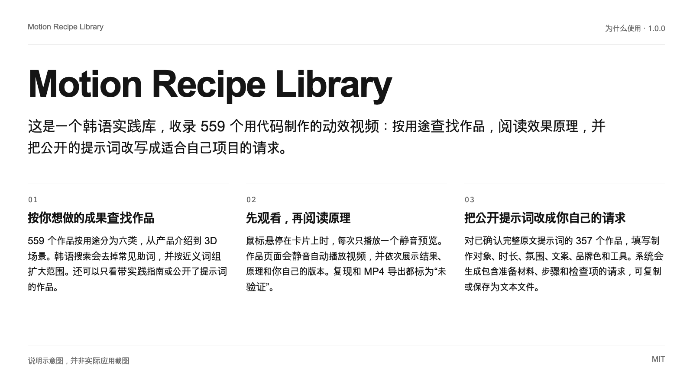
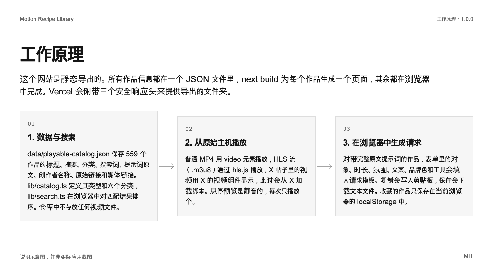
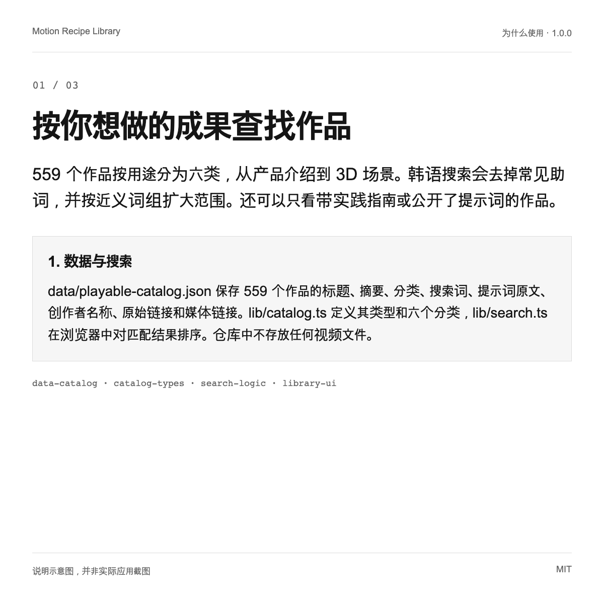
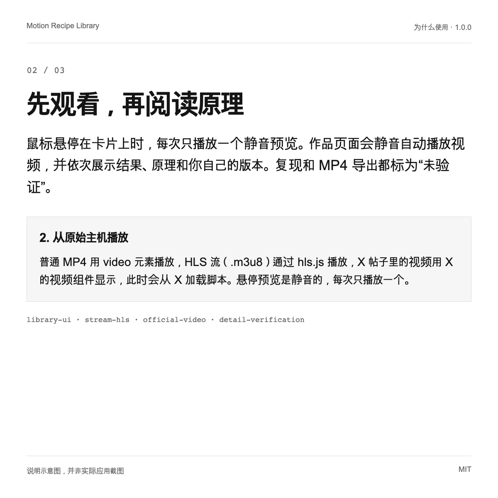
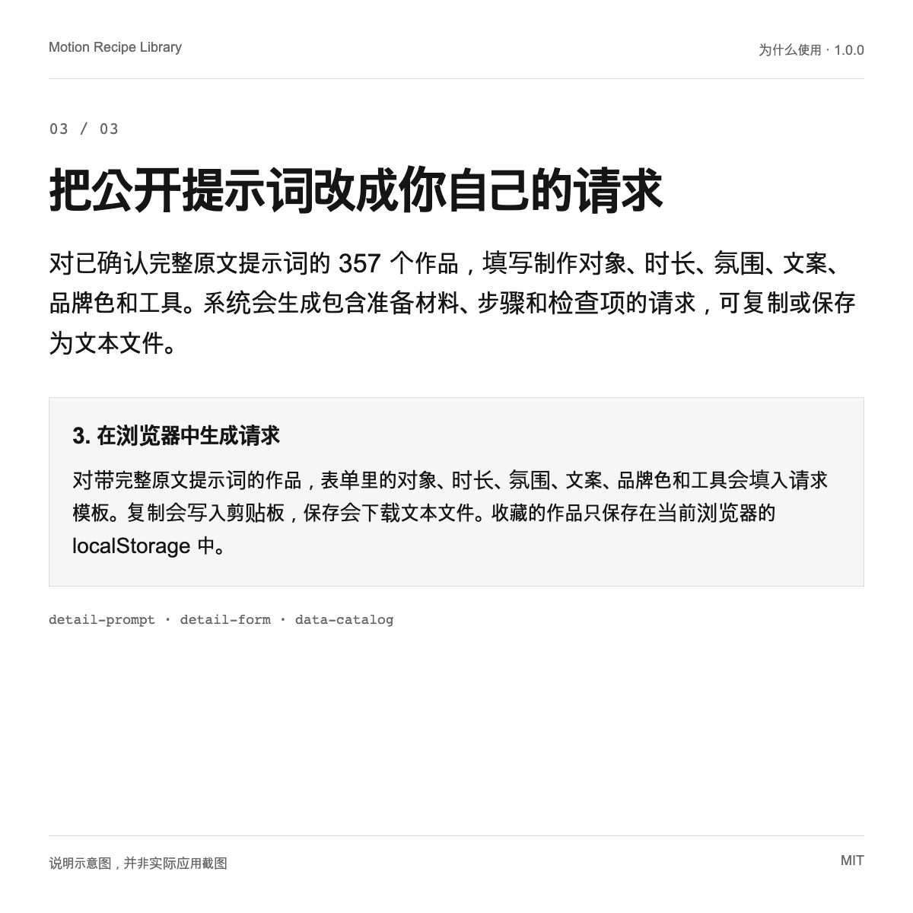

# Motion Recipe Library

这是一个韩语实践库，收录 559 个用代码制作的动效视频：按用途查找作品，阅读效果原理，并把公开的提示词改写成适合自己项目的请求。

[English](README.md) | [한국어](README.ko.md) | [日本語](README.ja.md) | **简体中文**




1.0.0 · MIT

## 为什么使用

| | |
| --- | --- |
| 按你想做的成果查找作品 | 559 个作品按用途分为六类，从产品介绍到 3D 场景。韩语搜索会去掉常见助词，并按近义词组扩大范围。还可以只看带实践指南或公开了提示词的作品。 |
| 先观看，再阅读原理 | 鼠标悬停在卡片上时，每次只播放一个静音预览。作品页面会静音自动播放视频，并依次展示结果、原理和你自己的版本。复现和 MP4 导出都标为“未验证”。 |
| 把公开提示词改成你自己的请求 | 对已确认完整原文提示词的 357 个作品，填写制作对象、时长、氛围、文案、品牌色和工具。系统会生成包含准备材料、步骤和检查项的请求，可复制或保存为文本文件。 |

## 快速开始

需要 Node.js 20.9 或更高版本（Next.js 16.4.0 的要求）和 npm。两个命令都在仓库根目录执行。视频直接从原始主机加载，因此需要联网。

```text
npm ci
npm run dev
```

Next.js 会启动开发服务器并输出本地地址（默认 http://localhost:3000），打开即可看到韩语界面的库。静态构建请运行 npm run build，结果会导出到 out 文件夹。

## 工作原理

这个网站是静态导出的。所有作品信息都在一个 JSON 文件里，next build 为每个作品生成一个页面，其余都在浏览器中完成。Vercel 会附带三个安全响应头来提供导出的文件夹。



### 1. 数据与搜索

data/playable-catalog.json 保存 559 个作品的标题、摘要、分类、搜索词、提示词原文、创作者名称、原始链接和媒体链接。lib/catalog.ts 定义其类型和六个分类，lib/search.ts 在浏览器中对匹配结果排序。仓库中不存放任何视频文件。

### 2. 从原始主机播放

普通 MP4 用 video 元素播放，HLS 流（.m3u8）通过 hls.js 播放，X 帖子里的视频用 X 的视频组件显示，此时会从 X 加载脚本。悬停预览是静音的，每次只播放一个。

### 3. 在浏览器中生成请求

对带完整原文提示词的作品，表单里的对象、时长、氛围、文案、品牌色和工具会填入请求模板。复制会写入剪贴板，保存会下载文本文件。收藏的作品只保存在当前浏览器的 localStorage 中。

## 使用场景

### 为产品介绍视频挑选参考作品

在“产品与服务介绍”分类里观看几个预览，再阅读喜欢的作品的原理。然后在表单中填入自己的服务名称、视频时长和颜色，把生成的请求交给你使用的 AI 智能体。

### 学习效果是如何实现的

其中 16 个作品带有实践指南，包含原理、准备材料、执行步骤、检查项和问题排查。这是为学习而编写的编辑资料，可以在让智能体实现之前先理解这项技法。

### 作为自己图库的基础结构来复用

应用读取一个格式固定的 JSON 文件并导出静态页面。把数据文件换成你有权展示的作品信息，修改权利说明页，再把 out 文件夹部署到任何能提供静态文件的地方即可。







## 限制与隐私

- 这个仓库里没有视频。视频和海报从原始主机加载，主机删除或更换文件后，对应作品就无法播放。播放情况是在 2026-10-07 收集数据并部署时检查的，之后没有持续监测。

- 作品、其提示词和媒体的权利归各创作者所有。MIT 许可只适用于代码和编辑文字。559 条记录中有 84 条来自没有找到许可声明的来源，复用前请先查看原始页面。

- 打开页面时会连接第三方主机：媒体主机、Google Fonts，以及用 X 组件显示帖子时的 X。这些主机可以看到访问者的 IP 地址。应用本身没有统计分析代码，也没有自己的 API 调用。

- 这个库原样展示收集到的提示词。我们没有运行过它们，也不声称 AI 智能体能复现同样的结果。数据中没有任何作品被标记为已执行、已复现或已导出，难度也未评估。没有完整原文提示词的作品不提供改写后的请求。

- 只收录收集数据时能在浏览器中播放的作品：在收集到的 818 条记录中占 559 条。其余 259 条保存在作者的私有工作文件夹中。

- 采集脚本、原始快照、测试脚本和验证日志都不在这个仓库里，因此无法从这里重新生成数据文件。请把它当作已审阅的快照。

- 应用界面和编辑文字只有韩语，只有这份 README 被翻译。收藏的作品只留在一个浏览器里，不会在设备之间同步。

## 验证状态

- **已验证运行**: 2026-10-08 在新克隆的仓库中，npm ci 安装了 33 个包，npm run typecheck（tsc --noEmit）以退出码 0 完成。
- **已验证运行**: 在同一个克隆中，npm run build 以退出码 0 完成，预渲染了 559 个作品页面、首页和权利说明页。npm run dev 在 http://localhost:3000 返回了 HTTP 200。
- **已验证运行**: 2026-10-08 运行脚本统计 data/playable-catalog.json，结果是作品 559 个、不同的创作者名称 503 个、实践指南 16 个、带完整原文提示词的作品 357 个。没有任何作品被标记为已执行、已复现或已导出。
- **已验证运行**: 统计每条记录 referenceUrl 的域名，结果是 skillry.dev 475、prompt-motion.com 38、remotion.dev 25、x.com 15、brochbuilds.com 6。
- **已检查代码**: 仓库包含 LICENSE（MIT）和 THIRD_PARTY_NOTICES.md，上游列表仓库的 MIT 声明保存在 public/notices 中。
- **文档说明**: 针对搜索、筛选、收藏、详情页播放、复制和下载的浏览器检查，是在部署前于作者的私有工作文件夹中运行的。这些测试脚本没有公开，因此仅凭这个仓库无法复现该结果。

## 下一步

可以在 https://motion-recipe-library.vercel.app 浏览线上站点。在其他地方使用作品之前，请先阅读 THIRD_PARTY_NOTICES.md。发现问题或有下架请求，请提交 Issue。

<details>
<summary>依据列表</summary>

[JSON](docs/showcase/sources.json)

- `data-catalog`: `data/README.md`, L1–L68 (已验证运行)
- `catalog-types`: `lib/catalog.ts`, L1–L83 (已检查代码)
- `search-logic`: `lib/search.ts`, L1–L76 (已检查代码)
- `library-ui`: `components/Library.tsx`, L56–L156 (已检查代码)
- `library-saved`: `components/Library.tsx`, L120–L136 (已检查代码)
- `detail-prompt`: `components/RecipeDetail.tsx`, L15–L96 (已检查代码)
- `detail-form`: `components/RecipeDetail.tsx`, L436–L483 (已检查代码)
- `detail-verification`: `components/RecipeDetail.tsx`, L197–L225 (已检查代码)
- `stream-hls`: `lib/use-stream.ts`, L1–L29 (已检查代码)
- `official-video`: `components/OfficialVideo.tsx`, L21–L105 (已检查代码)
- `creator-layout`: `app/layout.tsx`, L17–L35 (已检查代码)
- `fonts-import`: `app/globals.css`, L4–L4 (已检查代码)
- `notices-page`: `app/notices/page.tsx`, L1–L31 (已检查代码)
- `upstream-mit`: `public/notices/awesome-opus5-5-videos-MIT.txt`, L1–L21 (文档说明)
- `third-party`: `THIRD_PARTY_NOTICES.md`, L1–L74 (文档说明)
- `license-file`: `LICENSE`, L1–L21 (文档说明)
- `static-export`: `next.config.ts`, L1–L7 (已检查代码)
- `security-headers`: `vercel.json`, L1–L5 (已检查代码)
- `package-scripts`: `package.json`, L16–L21 (已验证运行)
- `node-engine`: `package-lock.json`, L788–L806 (文档说明)
- `private-boundary`: `.gitignore`, L9–L23 (文档说明)

- `find-by-intent` → `data-catalog`, `catalog-types`, `search-logic`, `library-ui`
- `see-and-understand` → `library-ui`, `stream-hls`, `official-video`, `detail-verification`
- `adapt-the-prompt` → `detail-prompt`, `detail-form`, `data-catalog`
- `data-search` → `data-catalog`, `catalog-types`, `search-logic`, `static-export`, `security-headers`
- `playback` → `stream-hls`, `official-video`, `library-ui`
- `worksheet` → `detail-prompt`, `detail-form`, `library-saved`
- `reference-for-intro` → `library-ui`, `detail-form`
- `learn-principle` → `detail-prompt`, `catalog-types`, `data-catalog`
- `reuse-structure` → `catalog-types`, `static-export`, `notices-page`
- `media-not-hosted` → `official-video`, `stream-hls`, `third-party`
- `rights` → `third-party`, `license-file`, `notices-page`
- `third-party-hosts` → `official-video`, `stream-hls`, `fonts-import`
- `not-reproduced` → `detail-verification`, `data-catalog`
- `selection` → `private-boundary`, `data-catalog`
- `pipeline-private` → `private-boundary`
- `korean-only` → `creator-layout`, `library-saved`
- `check-typecheck` → `package-scripts`
- `check-build` → `package-scripts`, `static-export`
- `check-data-counts` → `data-catalog`
- `check-sources` → `data-catalog`, `third-party`
- `check-license-files` → `license-file`, `third-party`, `upstream-mit`
- `check-browser-checks` → `private-boundary`
- `quickstart` → `package-scripts`, `node-engine`, `static-export`

</details>
